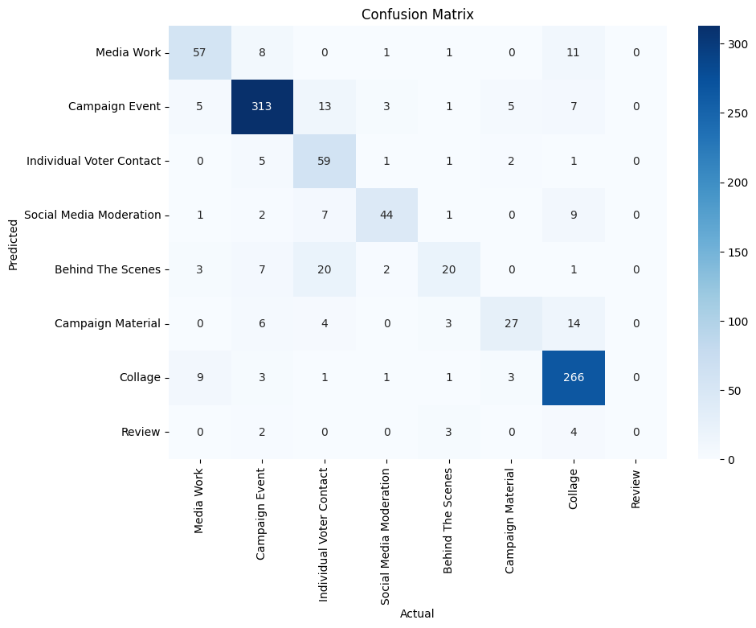

## Single Prompt Documentation

Model Metadata

- **Model Version**: `gpt-4o-2024-08-06`
- **Temperature**: `0`
- `response_format={"type": "json_object"}`
- **Other Parameters**: Defaults retained


### System Prompt

* We randomized the order of image types in the prompt for each request using the script below:

```python
bullets = [
        "- **Media Work**: Images that represent media coverage, such as screenshots of online newspapers, stills from TV interviews, talk shows, or press conferences. These images typically depict politicians interacting with traditional media outlets.",
        "- **Collage**: Images that contain a combination of visual elements, including text, logos, and multiple smaller pictures. These are not photographs of real-world events but are highly composed and often used for promotional or explanatory purposes.",
        "- **Campaign Event**: Images that document political events such as speeches, rallies, or formal gatherings. These usually feature a stage, a designated speaking area, or a politician addressing an audience in a public setting.",
        "- **Individual Voter Contact**: Images showing personal interactions between politicians and voters. Examples include selfies, autographs, or informal conversations, emphasizing direct, face-to-face engagement with the public.",
        "- **Social Media Moderation**: Casual, unpolished images where individuals, often politicians or their teams, engage directly with the camera in a less formal setting. These are non-studio photographs that convey spontaneity and a personal connection.",
        "- **Campaign Material**: Images showcasing campaign-related materials, such as photographs of posters, brochures, campaign booths, or any visual documentation of campaign paraphernalia.",
        "- **Behind The Scenes**: Images providing a glimpse into activities behind the stage or during breaks between events. These photographs highlight the informal, preparatory, or candid moments that are not part of the public-facing campaign activities."
    ]

async def system_prompt():

    random.shuffle(bullets)

    bullet_prompt = "\n".join(bullets)

    prompt = f"""
**Task: Image Classification in the Context of the 2021 German Federal Election Campaign**

**Objective:**
Classify Instagram images related to the 2021 German federal election campaign into one of the predefined categories, ensuring each image is assigned to exactly one category. Incorporate my examples below into your analysis.

**Classification Categories and Descriptions:**

{bullet_prompt}
* **Review**: Images that do not clearly fit into any of the above categories or require further review due to ambiguity or complexity.

**Final Classification:**
- Each image must be classified into exactly one of the categories above, based on the content and context provided in the image.
- Consider the visual and textual cues to make the most informed decision.

**Output Format:**
Return a JSON object with the following structure:
- explanation: str
- decision: str
    """

    return prompt
```


* For each Image Type, three few-shot images were provided. For each type, we sent a user message including the images and the message `{'decision': IMAGE_TYPE}`.

## Classification Results

| Category                 | Precision | Recall | F1-Score | Support |
| ------------------------ | --------- | ------ | -------- | ------- |
| Behind The Scenes        | 0.35      | 0.61   | 0.44     | 31      |
| Campaign Event           | 0.88      | 0.90   | 0.89     | 346     |
| Campaign Material        | 0.50      | 0.73   | 0.59     | 37      |
| Collage                  | 0.96      | 0.82   | 0.88     | 313     |
| Individual Voter Contact | 0.88      | 0.59   | 0.71     | 104     |
| Media Work               | 0.71      | 0.79   | 0.75     | 75      |
| Social Media Moderation  | 0.69      | 0.77   | 0.73     | 52      |
| Accuracy                 |           |        | 0.81*    | 958     |
| Macro Avg                | 0.71*     | 0.74*  | 0.71*    | 958     |
| Weighted Avg             | 0.85*     | 0.81*  | 0.82*    | 958     |

*: Excluding *Review*

