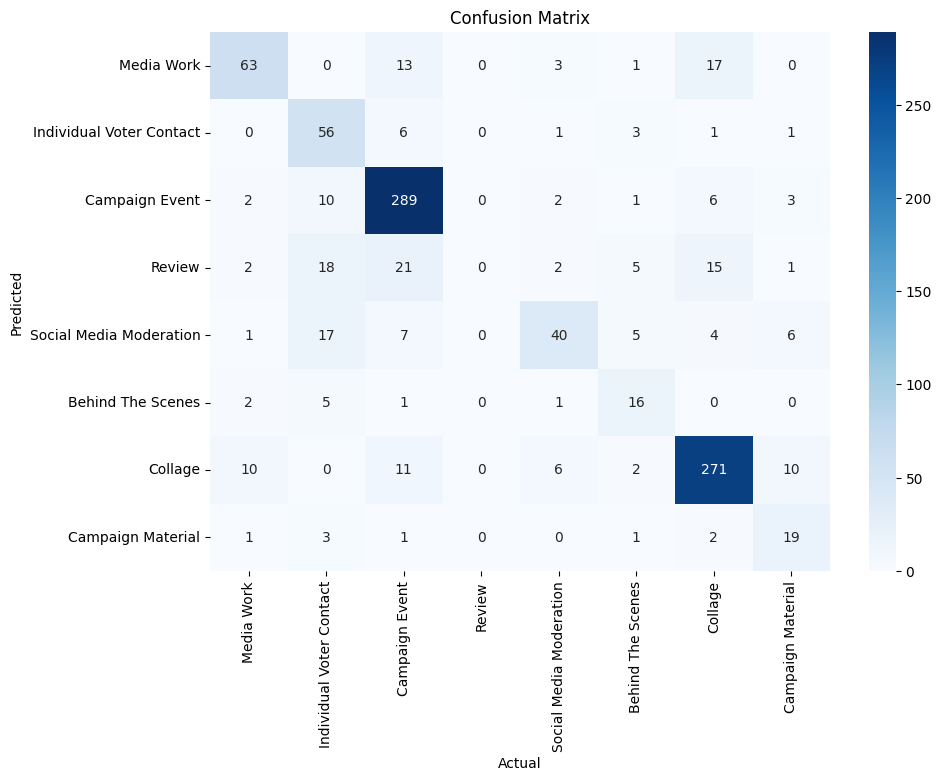

## Sequentia Documentation

Model Metadata

- **Model Version**: `gpt-4o-2024-08-06`
- **Temperature**: `0`
- **Other Parameters**: Defaults retained

### System Prompt

* See `Prompt_Q1..Q9.md`

* For each Image Type, three few-shot images were provided. We sent a user message for each type, including the images and the message `{'decision': IMAGE_TYPE}`.

## Classification Results

| Category                 | Precision | Recall | F1-Score | Support |
| ------------------------ | --------- | ------ | -------- | ------- |
| Behind The Scenes        | 0.59      | 0.42   | 0.49     | 31      |
| Campaign Event           | 0.93      | 0.83   | 0.87     | 346     |
| Campaign Material        | 0.69      | 0.49   | 0.57     | 37      |
| Collage                  | 0.88      | 0.86   | 0.87     | 313     |
| Individual Voter Contact | 0.82      | 0.51   | 0.63     | 106     |
| Media Work               | 0.65      | 0.79   | 0.71     | 78      |
| Social Media Moderation  | 0.49      | 0.71   | 0.58     | 52      |
| Accuracy                 |           |        | 0.77*    | 963     |
| Macro Avg                | 0.72*     | 0.66*  | 0.67*    | 963     |
| Weighted Avg             | 0.84*     | 0.77*  | 0.79*    | 963     |

*: Excluding *Review*

