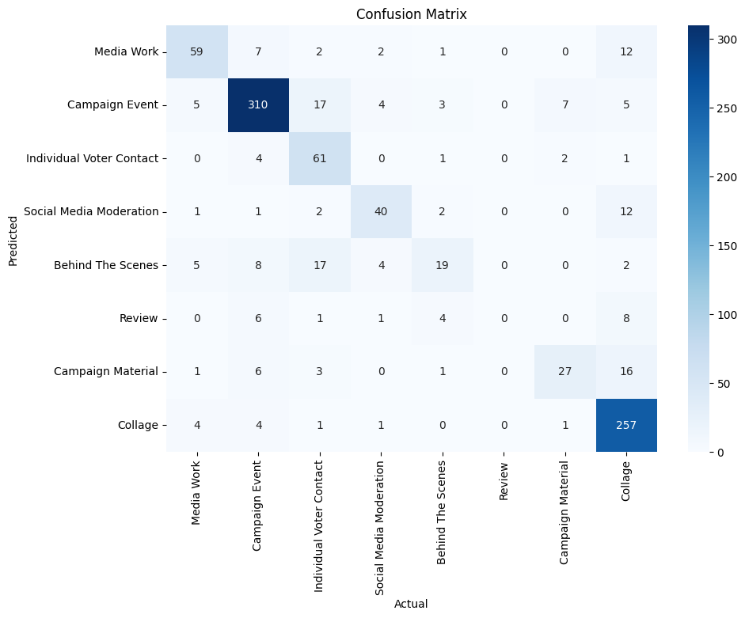

## Single Prompt Documentation

Model Metadata

- **Model Version**: `gpt-4o-2024-08-06`
- **Temperature**: `0`
- `response_format={"type": "json_object"}`
- **Other Parameters**: Defaults retained


### System Prompt

```
**Task: Image Classification in the Context of the 2021 German Federal Election Campaign**

**Objective:**
Classify Instagram images related to the 2021 German federal election campaign into one of the predefined categories, ensuring each image is assigned to exactly one category. Strictly follow the decision tree below and incorporate my examples below into your analysis.

**Classification Categories:**

1. **Media Work**

2. **Collage**

3. **Campaign Event**

4. **Individual Voter Contact**

5. **Social Media Moderation**

6. **Campaign Material**

7. **Behind The Scenes**

**Decision Tree-Based Instructions:**

**Strictly** follow the decision tree below to classify the images accurately:

**Start by determining if the image primarily contains a combination of text, images, logos, and pictures (excluding photographs documenting real-world events).**
   - If **yes**, proceed to Q18.
   - If **no**, proceed to Q9.

**Q18**: Assess if the image is a screenshot of an online newspaper or a still from a TV interview or similar event.**
   - If **yes**, classify as **Media Work**.
   - If **no**, classify as **Collage**.

**Q9**: Determine if the image shows a politician interacting with people off-stage (e.g., selfies, photos, autographs).**
   - If **yes**, classify as **Individual Voter Contact**.
   - If **no**, proceed to Q4.

**Q4**: Check if the image depicts a stage, designated speaking area, or a politician giving a speech in a political event context (excluding interviews, TV debates, campaign materials, and social media moderation).**
   - If **yes**, classify as **Campaign Event**.
   - If **no**, proceed to Q13.

**Q13**: Evaluate if the image shows a setting like a TV studio, media interview, radio interview, press conference, or talk show, as opposed to rallies, speeches, or informal social media moderation.**
   - If **yes**, classify as **Media Work**.
   - If **no**, proceed to Q7.

**Q7**: Determine if the image shows a person or people engaging directly with the camera in a casual, improvised manner, in a non-studio setting, without professional broadcasting equipment, and with a less polished appearance.**
   - If **yes**, classify as **Social Media Moderation**.
   - If **no**, proceed to Q17.

**Q17**: Determine if the image shows a crowd or spectators at an event.**
   - If **yes**, classify as **Campaign Event**.
   - If **no**, proceed to Q6.

**Q6**: Assess if the image displays real campaign materials, such as photos of posters, brochures, or campaign booths.**
   - If **yes**, classify as **Campaign Material**.
   - If **no**, proceed to Q19.

**Q19**: Evaluate if the image provides a behind-the-scenes view (e.g., people behind a stage or a politician on break between events).**
   - If **yes**, classify as **Behind The Scenes**.
   - If **no**, classify as **Review**.

**Final Classification:**

- Ensure each classification aligns strictly with the definitions and nuances of the categories as per the annotation manual.
- Accurately represent the context and content of the image related to the 2021 German federal election campaign.

**Output Format:**
Return a JSON object with the following structure:
  - explanation: str
  - decision: str

```

* For each Image Type, three few-shot images were provided. For each type, we sent a user message including the images and the message `{'decision': IMAGE_TYPE}`.

## Classification Results


| Image Type               | Precision | Recall | F1-Score | Support |
| ------------------------ | --------- | ------ | -------- | ------- |
| Behind The Scenes        | 0.38      | 0.65   | 0.48     | 31      |
| Campaign Event           | 0.90      | 0.90   | 0.90     | 346     |
| Campaign Material        | 0.50      | 0.73   | 0.59     | 37      |
| Collage                  | 0.94      | 0.85   | 0.89     | 313     |
| Individual Voter Contact | 0.86      | 0.57   | 0.68     | 104     |
| Media Work               | 0.73      | 0.76   | 0.75     | 75      |
| Social Media Moderation  | 0.69      | 0.85   | 0.76     | 52      |
| Accuracy                 |           |        | 0.82*    | 958     |
| Macro Avg                | 0.71*     | 0.76*  | 0.72*    | 958     |
| Weighted Avg             | 0.85*     | 0.82*  | 0.83*    | 958     |

*: Excluding *Review*

