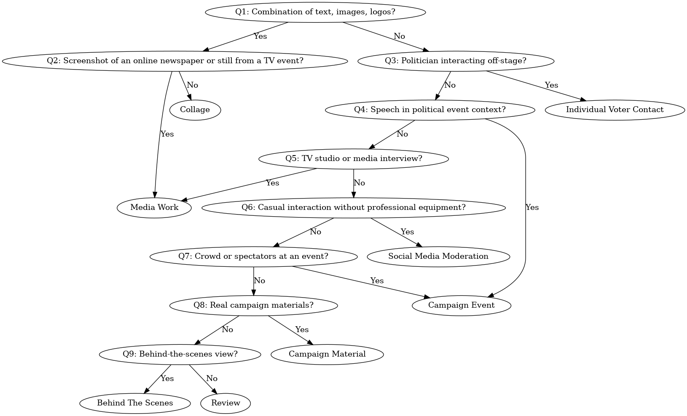
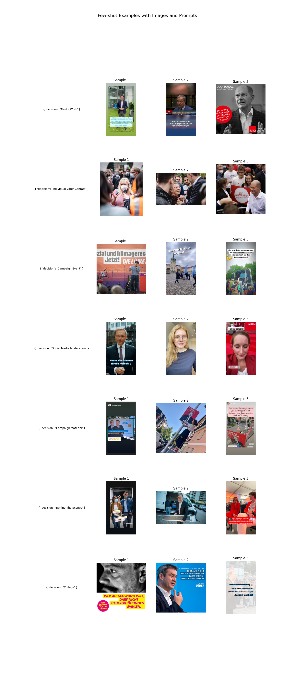

# GPT-4o for Visual Political Communication: Toward Automated Image Type Analysis [](https://doi.org/10.1145/3717867.3717881)


This repository serves as a digital appendix to our [WebSci'25 short paper](https://doi.org/10.1145/3717867.3717881). We introduce 

1. A decision tree to improve human annotation quality
2. Prompting `gpt-4o` for computational classification of visual political communication on Instagram.

---

This `README` file contains a visualization of the Decision Tree, an overview of the few-shot examples used when prompting, and a code snippet highlighting how few-shot examples were provided in the prompt.

The `/data` folder contains `CSV` files with classification results for each prompting scenario. All files include a 'Majority Human' column representing our Gold Standard, derived from the Decision Tree. The folder also contains the file `Few-Shot-Example-Paths.txt`, which allows you to filter the few-shot examples during the evaluation. 

The `/Prompts` folder contains one folder per prompting approach. Each subfolder contains Markdown files that include the prompts used in our experiments, the evaluation results, and API parameters.

The annotation manuals (in German) are located in the `/manuals` folder, with filenames corresponding to the question numbers (e.g., `Q1.md`, `Q2.md`).

| **Q#**                  | **Question**                                                 | **Yes Decision**             | **No Decision** |
| ----------------------- | ------------------------------------------------------------ | ---------------------------- | --------------- |
| [**Q1**](manuals/Q1.md) | Determine if the image primarily contains a combination of text, images, logos, and pictures (excluding photographs documenting real-world events). | → Q2                         | → Q3            |
| [**Q2**](manuals/Q2.md) | Assess if the image is a screenshot of an online newspaper or a still from a TV interview or similar event. | **Media Work**               | **Collage**     |
| [**Q3**](manuals/Q3.md) | Determine if the image shows a politician interacting with people off-stage (e.g., selfies, photos, autographs). | **Individual Voter Contact** | → Q4            |
| [**Q4**](manuals/Q4.md) | Check if the image depicts a stage, designated speaking area, or a politician giving a speech in a political event context (excluding interviews, TV debates, campaign materials, and social media moderation). | **Campaign Event**           | → Q5            |
| [**Q5**](manuals/Q5.md) | Evaluate if the image shows a setting like a TV studio, media interview, radio interview, press conference, or talk show, as opposed to rallies, speeches, or informal social media moderation. | **Media Work**               | → Q6            |
| [**Q6**](manuals/Q6.md) | Determine if the image shows a person or people engaging directly with the camera in a casual, improvised manner, in a non-studio setting, without professional broadcasting equipment, and with a less polished appearance. | **Social Media Moderation**  | → Q7            |
| [**Q7**](manuals/Q7.md) | Determine if the image shows a crowd or spectators at an event. | **Campaign Event**           | → Q8            |
| [**Q8**](manuals/Q8.md) | Assess if the image displays real campaign materials, such as photos of posters, brochures, or campaign booths. | **Campaign Material**        | → Q9            |
| [**Q9**](manuals/Q9.md) | Evaluate if the image provides a behind-the-scenes view (e.g., people behind a stage or a politician on break between events). | **Behind The Scenes**        | **Review**      |


### Decision Tree




### Few-Shot Examples

The image below shows the pictures we used in our few-shot prompt. Examples were selected once using pandas' `sample()` function. Then, the same examples were used for every request. Each line represents a separate user message. The text to the left is the textual message part. Few-Shot images were sent using `detail=low` setting.



## Code for Few-Shot Examples

```python
few_shot_prompt = []
few_shot_image_paths = {}
labels = eval_df['decision'].unique()
for label in labels:
  if label == "Review":
    continue

  few_shot_image_paths[label] = []

  few_shot_samples = eval_df[eval_df['decision'] == label].sample(n=3, random_state=4466) 

  few_shot_images = [{
      "type": "text",
      "text": f"{{ 'decision': '{label}' }}"
    }]
  for index, row in few_shot_samples.iterrows():
    image_base_64 = encode_image(row['image'])
    few_shot_image_paths[label].append(row['image'])

    few_shot_images.append({
        "type": "image_url",
        "image_url": {
            "url": f"data:image/jpeg;base64,{image_base_64}",
            "detail": "low"
        }
    })

  few_shot_prompt.append({
      "role": "user",
      "content": few_shot_images
  })
```


**Achmann-Denkler, M., Haim, M., & Wolff, C. (2025). [GPT-4o for Visual Political Communication: Toward Automated Image Type Analysis](https://doi.org/10.1145/3717867.3717881).**  
_In Proceedings of the 17th ACM Web Science Conference 2025 (WebSci '25), pp. 504–509._

If you use any part of this repository, please cite our paper:

```bibtex
@inproceedings{10.1145/3717867.3717881,
  author    = {Achmann-Denkler, Michael and Haim, Mario and Wolff, Christian},
  title     = {GPT-4o for Visual Political Communication: Toward Automated Image Type Analysis},
  booktitle = {Proceedings of the 17th ACM Web Science Conference 2025},
  pages     = {504--509},
  year      = {2025},
  publisher = {Association for Computing Machinery},
  address   = {New York, NY, USA},
  doi       = {10.1145/3717867.3717881},
  url       = {https://doi.org/10.1145/3717867.3717881}
}
